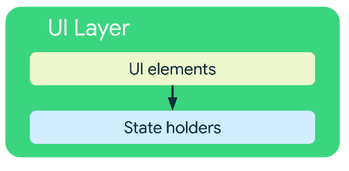
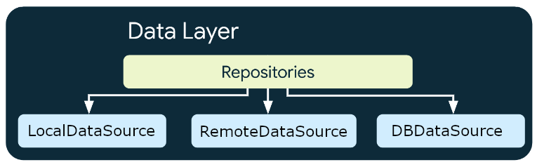

# android-kotlin-mvvm-architecture

## Introduction
This Android app shows a sample implementation of the Android recommended architecture, as described in ["Guide to app architecture"](https://developer.android.com/topic/architecture)

The application (coded in Kotlin) demonstrates the use of:
- Dagger 2 for dependency injection.
- MVVM.
- Retrofit for communications.
- Room as local database.

## The application: Delicious Cocktails
The application uses the [TheCocktaildDB](https://www.thecocktaildb.com/) API for showing cocktails recipes.

It consists of a home screen very similar to Netflix or Amazon Prime Video home, featuring a random list of cocktails at the top. Below, there are separate lists for alcoholic cocktails and non-alcoholic cocktails.
At the bottom of the screen is located the list of favorite cocktails (that will show every cocktail marked as favorite by the user).

By clicking on a cocktail item the application navigates to the cocktail detail screen, that shows a photograph of the cocktail, its characteristics, the ingredients and measures and the recipe.

By clicking on each section header (Alcoholic Cocktails, Non-Alcoholic Cocktails, Favorite Cocktails), the application navigates to the respective cocktails list.

https://github.com/migualador/android-kotlin-mvvm-architecture/assets/18292714/f538829b-ae55-4f3f-8fb3-68681cdbadac

## Architecture
This application has been developed following the Android ["Guide to app architecture"](https://developer.android.com/topic/architecture) as a demonstration of how to apply the guidelines to a real project.
The architecture itself consists of three layers:
The architecture uses three layers:
- UI layer.
- Domain layer.
- Data layer.

### UI Layer
The UI layer is responsible of showing the information to the user as well as handling the user interactions. It uses a MVVM pattern.

The UI elements are one Activity (with very little responsibility aside from holding fragments) and the fragments that represent the screens.
As the state holder we use the ViewModel class from Android framework.

The state flows from the ViewModel to the corresponding fragment via a LiveData (that holds UI state class).
- The ViewModel updates LiveData state when there is a change in the model.
- The fragment observes LiveData so it can update the UI when necessary.

The events (interactions, etc) in the UI are notified from the fragment to the ViewModel by simply calling a ViewModel method.

The UI layer has its own data entities (UI state classes) that models:
- The information to be shown in the screen.
- The navigations to be done by the UI.

Note: The choice of having separate streams (LiveData) for each data (one for Featured Cocktails list, one for Alcoholic Cocktails list,...) is based on the independence of these different data. If only one stream were used, updating one data would result in refreshing nearly the entire screen. While one possibility is to implement differential mechanisms within the fragment, doing so exceeds the scope of this simple example.

### Domain Layer
The domain layer encapsulates the business logic, acting as a bridge between the UI layer and the Data layer.
This layer relays in UseCases. Each use case covers a part of the business logic, providing to the ViewModel a way of performing some operation with the data.
UseCases also provides main-safety, moving the execution to a background thread by using coroutines.

### Data Layer
The data layer is responsible of exposing data and centralizing changes.
It is composed of repositories that use the information provided by data sources. A repository is responsible of coordinating the information of all the data sources that it uses.

A common repository has 3 data sources:
- Local data source (holds the data in memory)
- Remote data source (uses Retrofit to retrieve data from a REST API)
- Database data source (uses Room to persist the data)

 
The repository implements a policy that optimizes data retrieval speed while ensuring the application's operation when there is no access to the internet.
1. The repository attempts to retrieve data from the local data source (memory).
2. If there is no data available in the local data source it tries to fetch it from remote data source (network).
3. If the retrieval from network is successful, the repository uses this data, storing it in both the local data source and the database data source for later retrievals.
4. In case of unsuccessful retrieval from network, the repository will attempt to retrieve data from the database source (previously persisted data).

The use of a database (persistence) as a last-resort data source ensures that even when there is no connection, the core functionalities of the application remain available.

## Still under development
Future steps include:
- [X] Adding three levels of data sources in repositories: memory datasource, remote datasource (network) and local database datasource (Room).
- [X] Tests.
- [X] UI in Jetpack Compose (at this moment only HomeFragment)
